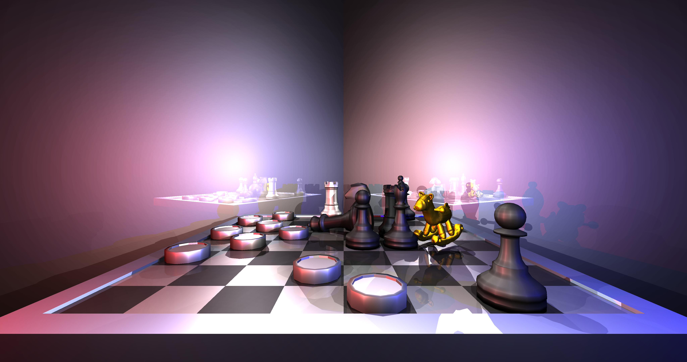
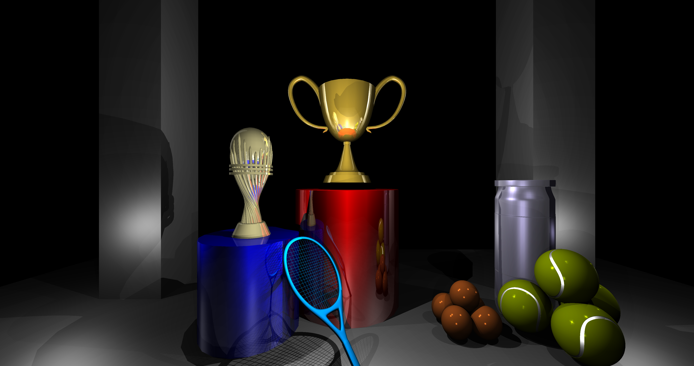

# Java Ray Tracer

This project is a fully functional ray tracer implemented in Java, built from scratch without external frameworks. It demonstrates advanced rendering techniques and supports creating photorealistic images by defining scenes programmatically.

## 🌟 Features
- **Blinn-Phong Shading:** Adds realistic shininess to objects.
- **Reflection and Refraction:** Simulates light bouncing and passing through transparent objects.
- **Depth of Field:** Adds focus effects for realistic rendering.
- **Transformations:** Supports object rotation and scaling.
- **OBJ Reader:** Integrated loader for 3D object files.
- **Customizable Scenes:** Define and render your own scenes directly in the code.

## 🚀 Getting Started

### Prerequisites
- **Java Development Kit (JDK):** Version 8 or higher.
- **IDE/Text Editor:** Any IDE like IntelliJ IDEA, Eclipse, or a simple text editor.

### Installation
1. Clone the repository:
   ```bash
   git clone https://github.com/yourusername/java-ray-tracer.git
   cd java-ray-tracer
2. Open the project in your preferred IDE.
3. Build the project.

### Creating a Scene
You can create and render a custom scene by editing the RayTracer.java file.

```java
public static void main(String[] args) {
    System.out.println(new Date());
    Scene scene01 = new Scene();
    scene01.setCamera(new Camera(new Vector3D(0, 0, -4), 80, 80, 800, 800, 2, 60));
    // Define your scene objects here

    raytrace(scene01);
    FileManager.saveImage(image, "imagen", "png");
}
```

Define objects in the scene by adding them to the scene01 object, specifying their properties such as position, color, and transformations.
You can also use the *sample_scene.txt* file

### 🎨 Example Output



### 📚 Project Structure
- Scene: Contains definitions for camera, lights, and objects.
- RayTracer.java: Entry point for configuring and rendering scenes.
- FileManager: Handles saving rendered images to disk.
- OBJ Reader: Loads 3D models for inclusion in scenes.

### 💡 Rendering Techniques
- Blinn-Phong Model: For realistic light interaction on surfaces.
- Recursive Ray Tracing: For accurate reflection and refraction effects.
- Transformations: Rotate and scale objects within the scene.

### 🛡️ Usage Notes
- Rendering large scenes or high-resolution images may take time depending on your system's performance.
- Ensure sufficient memory allocation if handling large OBJ files.

### 📧 Contact
Have questions or suggestions? Reach out:
- Email: 0252028@up.edu.mx
  
